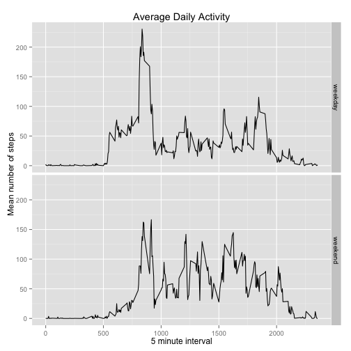

```r
library(dplyr)
```

```
## 
## Attaching package: 'dplyr'
## 
## The following objects are masked from 'package:stats':
## 
##     filter, lag
## 
## The following objects are masked from 'package:base':
## 
##     intersect, setdiff, setequal, union
```

```r
library(ggplot2)
```

## Loading and preprocessing the data
Unzip the activity data and read, specifying column types

```r
unzip("activity.zip")
raw<-read.csv("activity.csv",colClasses = c('integer', 'Date', 'integer'))
head(raw)
```

```
##   steps       date interval
## 1    NA 2012-10-01        0
## 2    NA 2012-10-01        5
## 3    NA 2012-10-01       10
## 4    NA 2012-10-01       15
## 5    NA 2012-10-01       20
## 6    NA 2012-10-01       25
```

## What is mean total number of steps taken per day?
First group the data by date and then calculate the sum of steps for each day, ignoring NA values

```r
daily_totals<-
        group_by(raw,date) %>% 
        summarise(total_steps=sum(steps,na.rm=T))
head(daily_totals)
```

```
## Source: local data frame [6 x 2]
## 
##         date total_steps
## 1 2012-10-01           0
## 2 2012-10-02         126
## 3 2012-10-03       11352
## 4 2012-10-04       12116
## 5 2012-10-05       13294
## 6 2012-10-06       15420
```

Plot a histogram showing the distribution of total steps per day, grouped in intervals of 500.  


```r
gg <- ggplot(daily_totals, aes(x=total_steps))
gg + geom_histogram(binwidth=500) + 
        xlab("steps") + 
        ylab("days") + 
        ggtitle("Distribution of Total Steps Per Day")
```

 
  
Calculate the mean and median total number of steps per day

```r
mean_daily_steps<-mean(daily_totals$total_steps)
median_daily_steps<-median(daily_totals$total_steps)
sprintf(" The mean total number of steps per day is %0.2f and the median value is %0.2f",
        mean_daily_steps, median_daily_steps)
```

```
## [1] " The mean total number of steps per day is 9354.23 and the median value is 10395.00"
```

## What is the average daily activity pattern?
The 'interval' in the raw data is an encoding of the start time of each five minute interval in the day, e.g. the interval starting at 11:35 am is recorded as 1135.
Group the raw data by 'interval' and then calculate the sum of steps for each interval.  


```r
daily_activity<-
        group_by(raw,interval) %>% 
        summarise(mean_steps=mean(steps,na.rm=T))
gg <- ggplot(daily_activity, aes(x=interval, y=mean_steps, group=1))
gg + geom_line() + 
        xlab("5 minute interval") + 
        ylab("Mean number of steps") + 
        ggtitle("Average Daily Activity")
```

 

Now find the busiest 5-minute mean interval across all days.


```r
maximum_steps_per_interval <- max(daily_activity$mean_steps)
maximum_steps_per_interval
```

```
## [1] 206.1698
```

```r
busiest_interval<-
        daily_activity[daily_activity$mean_steps == maximum_steps_per_interval,"interval"]$interval
sprintf("The 5-minute interval starting at %02d:%02d contains the maximum number of steps (%0.02f) on average",
        busiest_interval %/% 100, 
        busiest_interval %% 100, 
        maximum_steps_per_interval)
```

```
## [1] "The 5-minute interval starting at 08:35 contains the maximum number of steps (206.17) on average"
```

## Imputing missing values

```r
missing_values_count <- nrow(raw) - nrow(na.omit(raw))
missing_values_count
```

```
## [1] 2304
```
The raw data contains 2304 rows with missing values. We will impute the missing values by substituting the mean number of steps for the given interval that we previoulsy calculated


```r
imputed_data <- raw
imputed_data$steps[is.na(imputed_data$steps)] <-
        daily_activity$mean_steps[
                match(imputed_data$interval[is.na(imputed_data$steps)],
                      daily_activity$interval)]
```

The following histogram shows the distribution of total steps per day for the imputed data, grouped in intervals of 500.  


```r
imputed_daily_totals<-group_by(imputed_data,date) %>% 
        summarise(total_steps=sum(steps,na.rm=T))
gg <- ggplot(imputed_daily_totals, aes(x=total_steps))
gg + geom_histogram(binwidth=500) + 
        xlab("steps") + 
        ylab("days") + 
        ggtitle("Distribution of Total Steps Per Day (Imputed)")
```

 

```r
mean_imputed_daily_steps<-mean(imputed_daily_totals$total_steps)
mean_imputed_daily_steps
```

```
## [1] 10766.19
```

```r
median_imputed_daily_steps<-median(imputed_daily_totals$total_steps)
median_imputed_daily_steps
```

```
## [1] 10766.19
```

```r
sprintf("The mean total number of steps taken per day was %0.2f for the raw data",
        mean_daily_steps)
```

```
## [1] "The mean total number of steps taken per day was 9354.23 for the raw data"
```

```r
sprintf("and is now %0.2f with imputed interval values", 
        mean_imputed_daily_steps)
```

```
## [1] "and is now 10766.19 with imputed interval values"
```

```r
sprintf("The medan value was %0.2f for the raw data and is %0.2f with the imputed values", 
        median_daily_steps,
        median_imputed_daily_steps)
```

```
## [1] "The medan value was 10395.00 for the raw data and is 10766.19 with the imputed values"
```

The mean total number of steps taken per per day was **9354.23** for the raw data
and is now **10766.19** with imputed interval values.
The medan value was **10395.00** for the raw data
and is now **10766.19** with the imputed data.

## Are there differences in activity patterns between weekdays and weekends?

Add a column to the imputed data to indicate whether the day is a week day or a weekend.  Calculate the mean number of steps per interval per type of day.

```r
get_type_of_day <- function(date) {
        if (weekdays(date) %in% c("Saturday", "Sunday"))
                "weekend"
        else
                "weekday"
}
imputed_data$type_of_day <- sapply(imputed_data$date, get_type_of_day)
imputed_daily_activity <- group_by(imputed_data,interval, type_of_day) %>%
        summarise(mean_steps=mean(steps,na.rm=T))
head(imputed_daily_activity)
```

```
## Source: local data frame [6 x 3]
## Groups: interval
## 
##   interval type_of_day mean_steps
## 1        0     weekday 2.25115304
## 2        0     weekend 0.21462264
## 3        5     weekday 0.44528302
## 4        5     weekend 0.04245283
## 5       10     weekday 0.17316562
## 6       10     weekend 0.01650943
```

The following plot shows the mean daily activity for each interval by weekday and weekend.


```r
gg <- ggplot(imputed_daily_activity, aes(x=interval, y=mean_steps))
gg + geom_line() + 
        xlab("5 minute interval") + 
        ylab("Mean number of steps") + 
        ggtitle("Average Daily Activity") +
        facet_grid(type_of_day~.)
```

 

## Conclusion
The analysis reveals that, on average, the subject is more activity in the early morning on week days compared to weekends.  Also there appears to be more activity during the day at weekends compared to weekdays.  This pattern of activity would suggest the subject travels to work each weekday where they have a fairly sedantary job (office worker?). However, the subject rises later at weekends (no work) but is more active during the day.

