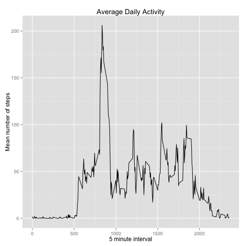

```r
library(plyr)
library(dplyr)
library(ggplot2)
```

## Loading and preprocessing the data
Unzip the activity data and read

```r
unzip("activity.zip")
raw<-read.csv("activity.csv",colClasses = c('integer', 'Date', 'integer'))
head(raw)
```

```
##   steps       date interval
## 1    NA 2012-10-01        0
## 2    NA 2012-10-01        5
## 3    NA 2012-10-01       10
## 4    NA 2012-10-01       15
## 5    NA 2012-10-01       20
## 6    NA 2012-10-01       25
```

## What is mean total number of steps taken per day?
First group the data by date and then calculate the sum of steps for each day, ignoring NA values

```r
daily_totals<-group_by(raw,date) %>% summarise(total_steps=sum(steps,na.rm=T))
```
Plot a histogram showing the distribution of total steps per day, grouped in intervals of 500.  


```r
gg <- ggplot(daily_totals, aes(x=total_steps))
gg + geom_histogram(binwidth=500) + xlab("steps") + ylab("days") + ggtitle("Distribution of Total Steps Per Day")
```

 
  
Calculate the mean and median total number of steps per day

```r
mean_daily_steps<-mean(daily_totals$total_steps)
median_daily_steps<-median(daily_totals$total_steps)
```
The mean total number of steps taken per per day is **9354.23** 
and the median value is **10395.00**.

## What is the average daily activity pattern?
The 'interval' in the raw data is an encoding of the start time of each five minute interval in the day, e.g. the interval starting at 11:35 am is recorded as 1135.
Group the raw data by 'interval' and then calculate the sum of steps for each interval.  The plot uses 'interval' as a factor on the x axis as we need to allow for the fact that it is encoded and not a scalar value.


```r
daily_activity<-group_by(raw,interval) %>% summarise(mean_steps=mean(steps,na.rm=T))
gg <- ggplot(daily_activity, aes(x=as.factor(interval), y=mean_steps, group=1))
gg + geom_line() + xlab("5 minute interval") + ylab("Mean number of steps") + ggtitle("Average Daily Activity")
```

 
  


```r
maximum_steps_per_interval = max(daily_activity$mean_steps)
busiest_interval<-daily_activity[daily_activity$mean_steps == maximum_steps_per_interval,"interval"]$interval
```
The 5-minute interval starting at start 
08:35
contains the maximum number of steps on average across all the days in the dataset.

## Imputing missing values

```r
missing_values_count <- nrow(raw) - nrow(na.omit(raw))
```
The raw data contains 2304 rows with missing values. We will impute the missing values by substituting the mean number of steps for the given interval.


```r
impute <- function(x, fun) {
     missing <- is.na(x)
     replace(x, missing, fun(x[!missing])) }
imputed_data <-ddply(raw, ~ interval , transform, steps = impute(steps, mean))
```

The following histogram shows the distribution of total steps per day for the imputed data, grouped in intervals of 500.  


```r
imputed_daily_totals<-group_by(imputed_data,date) %>% summarise(total_steps=sum(steps,na.rm=T))
gg <- ggplot(imputed_daily_totals, aes(x=total_steps))
gg + geom_histogram(binwidth=500) + xlab("steps") + ylab("days") + ggtitle("Distribution of Total Steps Per Day (Imputed)")
```

 

```r
mean_imputed_daily_steps<-mean(imputed_daily_totals$total_steps)
median_imputed_daily_steps<-median(imputed_daily_totals$total_steps)
```

The mean total number of steps taken per per day was **9354.23** for the raw data
and is now **10766.19** with imputed mean interval values.
The medan value was **10395.00** for the raw data
and is now **10766.19** with the imputed data.

## Are there differences in activity patterns between weekdays and weekends?
